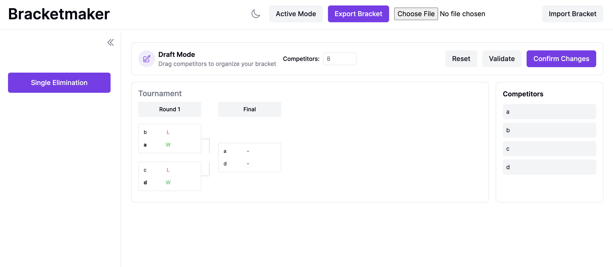

# CSCE606-Project-3-Group-10 - Tournament Bracket Editor

A Ruby on Rails web application for creating and managing single-elimination tournament brackets with drag-and-drop functionality, real-time editing, and CSV import/export capabilities.



## Table of Contents

- [Deployment](#deployment)
- [Features](#features)
- [Technology Stack](#technology-stack)
- [Getting Started](#getting-started)
  - [Prerequisites](#prerequisites)
  - [Installation](#installation)
  - [Database Setup](#database-setup)
- [Running the Application](#running-the-application)
- [Testing](#testing)
  - [RSpec Tests](#rspec-tests)
  - [Cucumber Tests](#cucumber-tests)
  - [System Tests with Capybara](#system-tests-with-capybara)
  - [Test Coverage](#test-coverage)
- [Project Structure](#project-structure)
- [Key Features](#key-features)
- [API Endpoints](#api-endpoints)
- [Contributing](#contributing)
- [License](#license)

## Deployment

https://csce606-project-3-group-10-a278b56c7b43.herokuapp.com/

## Features

- **Single Elimination Brackets**: Create tournament brackets with 2-64 competitors
- **Drag-and-Drop Interface**: Reorganize competitors in Draft Mode using intuitive drag-and-drop
- **Dual Mode System**:
  - **Draft Mode**: Edit bracket structure, add/remove competitors, reorganize matches
  - **Active Mode**: Select match winners and advance competitors through rounds
- **CSV Import/Export**: Save and load tournament brackets via CSV files
- **Dark Mode Support**: Toggle between light and dark themes
- **Local Storage Persistence**: Automatically saves bracket state in browser
- **Responsive Design**: Works on desktop and mobile devices using Tailwind CSS
- **Real-time Validation**: Ensures bracket integrity with automatic win propagation

## Technology Stack

- **Backend**: Ruby 3.2.3, Rails 6.1.7
- **Database**: SQLite3
- **Frontend**: JavaScript (ES6), Tailwind CSS
- **Testing**: RSpec, Cucumber, Capybara, Selenium WebDriver
- **Build Tools**: Yarn, Webpacker

## Getting Started

### Prerequisites

- Ruby 3.2.3
- Rails 6.1.7+
- SQLite3
- Node.js and Yarn
- Chrome/Chromium (for testing)

### Installation

1. Clone the repository:

```bash
git clone <repository-url>
cd TournamentEditor
```

2. Install Ruby dependencies:

```bash
bundle install
```

3. Install JavaScript dependencies:

```bash
yarn install
```

4. Build TailwindCSS asset file:

```bash
bundle exec rails tailwindcss:build
```

### Database Setup

1. Create and migrate the database:

```bash
rails db:create
rails db:migrate
```

2. (Optional) Seed the database:

```bash
rails db:seed
```

## Running the Application

### Development Server

Start the Rails server:

```bash
rails server
```

Or use the development process manager (with Tailwind CSS auto-compilation):

```bash
bin/dev
```

The application will be available at `http://localhost:3000`

### Key Routes

- `/` - Main bracket editor interface
- `/style` - Tailwind CSS style guide
- `/tournaments` - Tournament management

## Testing

This application uses three testing frameworks to ensure comprehensive coverage:

### RSpec Tests

RSpec is used for unit and integration testing of models, controllers, and views.

**Run all RSpec tests:**

```bash
bundle exec rspec
```

**Run specific test files:**

```bash
bundle exec rspec spec/models/tournament_spec.rb
bundle exec rspec spec/controllers/tournaments_controller_spec.rb
```

**Run with documentation format:**

```bash
bundle exec rspec --format documentation
```

**Test Coverage Breakdown:**

- **Models**: Tournament model with CSV import/export
- **Controllers**: Application, Style, and Tournaments controllers
- **Views**: Layout templates and partials
- **JavaScript**: BracketManager and TournamentState classes
- **Routes**: Route configuration
- **Integration**: End-to-end CSV workflow


### Cucumber Tests

Cucumber provides behavior-driven development (BDD) tests written in Gherkin syntax for feature validation.

**Run all Cucumber features:**

```bash
bundle exec cucumber
```

**Run specific feature files:**

```bash
bundle exec cucumber features/bracket_draft_mode.feature
bundle exec cucumber features/dark_mode_toggle.feature
```

**Run with specific tags:**

```bash
bundle exec cucumber --tags @javascript
```

**Feature Coverage:**

- Bracket Draft Mode controls and functionality
- Bracket Mode toggle (Draft/Active)
- Bracket structure and layout validation
- Drag-and-drop operations with auto-win propagation
- Dark Mode toggle
- Sidebar navigation
- Topbar components
- Tournament management


### System Tests with Capybara

Capybara enables browser automation testing using Selenium WebDriver.

**Run system tests:**

```bash
rails test:system
```

**Run specific system test:**

```bash
rails test test/system/capybara_setup_test.rb
```

**Configuration:**

- Driver: Selenium Chrome
- Screen size: 1400x1400
- Default wait time: 5 seconds

**System Test Coverage:**

- Page navigation and content verification
- Form interactions (input fields, textareas)
- Button clicks and element interactions
- CSS selector verification
- JavaScript-driven UI components


### Test Coverage

Code coverage is tracked using SimpleCov and runs automatically with the test suite.

**View coverage report:**

```bash
bundle exec rspec
open coverage/index.html
```

**Coverage Targets:**

- Minimum overall coverage: 90%
- Minimum per-file coverage: 80%

**Coverage by Component:**

- Models
- Controllers
- Views
- Helpers
- JavaScript modules

### Running All Tests

**Run complete test suite:**

```bash
# RSpec tests
bundle exec rspec

# Cucumber features
bundle exec cucumber

# System tests
rails test:system
```

### Test Database Management

**Reset test database:**

```bash
RAILS_ENV=test rails db:reset
```

**Clean test database:**

```bash
RAILS_ENV=test rails db:test:prepare
```

## Project Structure

```
TournamentEditor/
├── app/
│   ├── controllers/       # Rails controllers
│   ├── models/           # ActiveRecord models
│   ├── views/            # ERB templates
│   └── javascript/       # JavaScript modules
├── public/
│   └── javascripts/      # Client-side JavaScript
│       ├── bracket_manager.js
│       ├── brackets_viewer.js
│       ├── tournament_state.js
│       ├── add_competitors.js
│       └── competitor_edit_delete.js
├── spec/                 # RSpec tests
│   ├── models/
│   ├── controllers/
│   ├── views/
│   └── javascripts/
├── features/             # Cucumber features
│   ├── step_definitions/
│   └── support/
├── test/                 # Minitest system tests
│   └── system/
├── config/
│   ├── routes.rb
│   └── database.yml
└── db/
    ├── migrate/
    └── schema.rb
```

## Key Features

### Draft Mode

- Create brackets with 2-64 competitors
- Drag-and-drop to reorganize competitors
- Add/edit/delete competitor names
- Reset bracket to initial state
- Validate bracket structure
- Confirm and save changes

### Active Mode

- Click matches to select winners
- Automatic advancement to next rounds
- Winner/loser result tracking
- Match completion status

### CSV Import/Export

- Export current bracket to CSV
- Import previously saved brackets
- Preserve match data and participant information

### Persistence

- Automatic local storage saves
- Bracket state restoration on page load
- Mode persistence (Draft/Active)

## API Endpoints

### Tournament Management

- `GET /tournaments` - List all tournaments (HTML/CSV)
- `POST /tournaments/import` - Import tournaments from CSV
- `POST /tournaments/update_bracket` - Update bracket data (JSON)

## Contributing

1. Fork the repository
2. Create a feature branch (`git checkout -b feature/amazing-feature`)
3. Commit your changes (`git commit -m 'Add amazing feature'`)
4. Push to the branch (`git push origin feature/amazing-feature`)
5. Open a Pull Request

## License

This project is licensed under the MIT License - see the LICENSE file for details.
